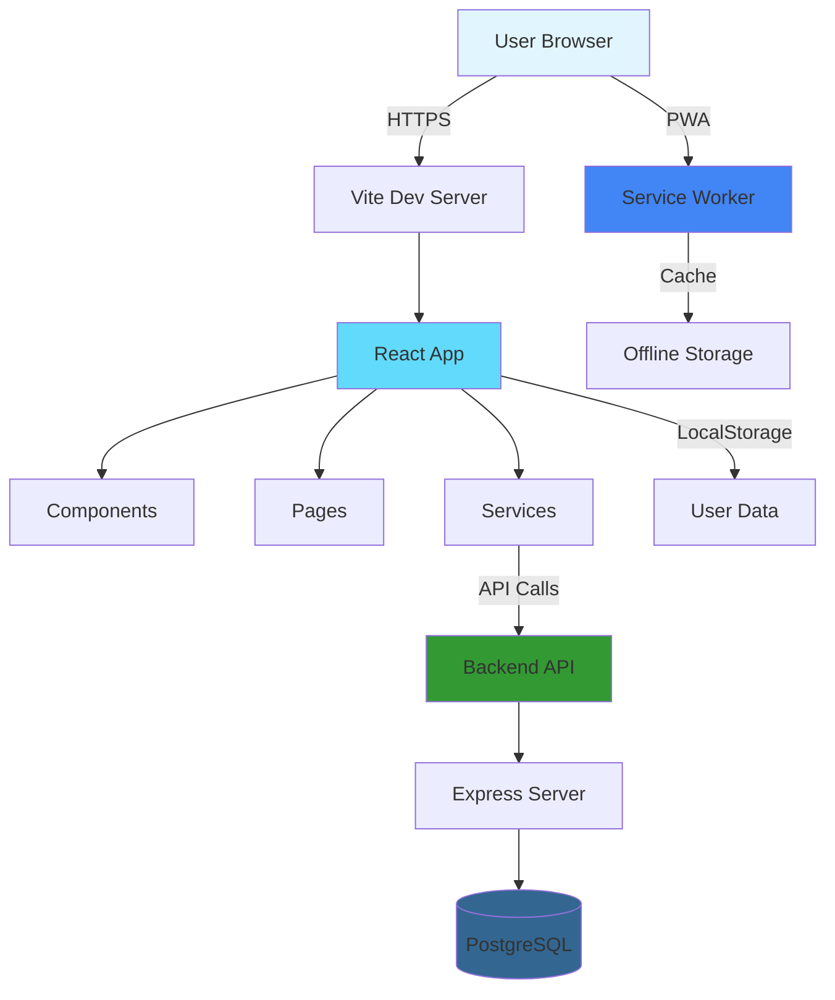
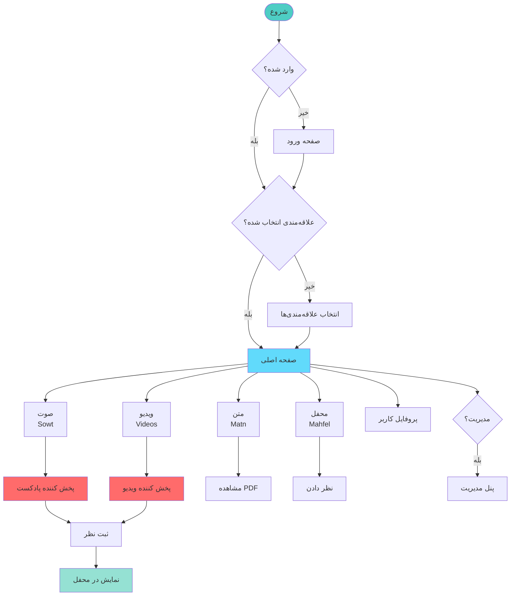
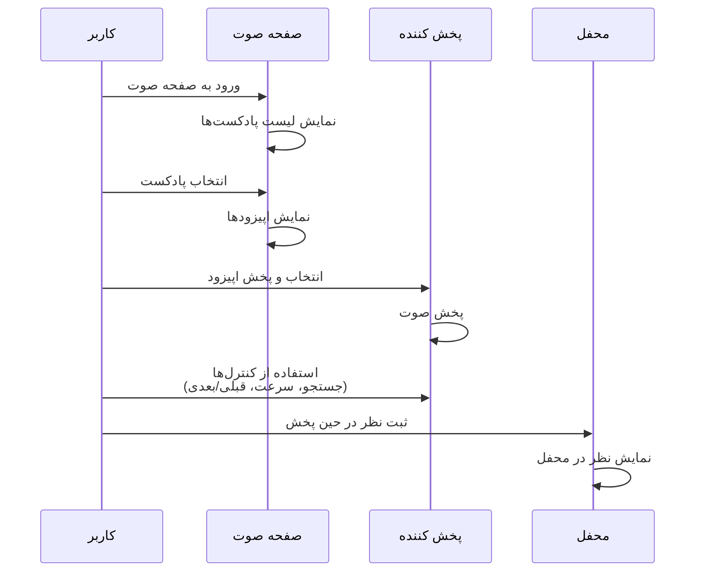
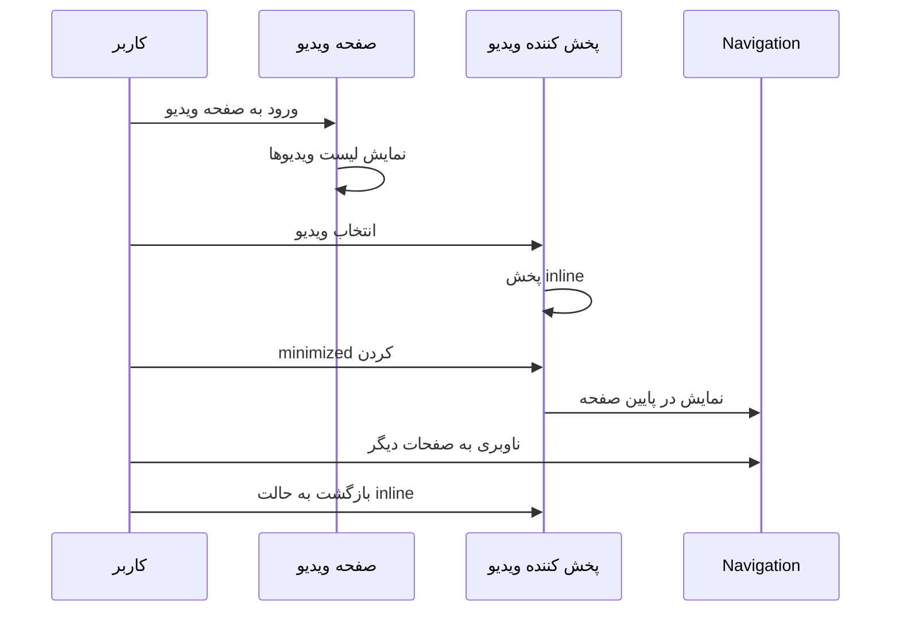
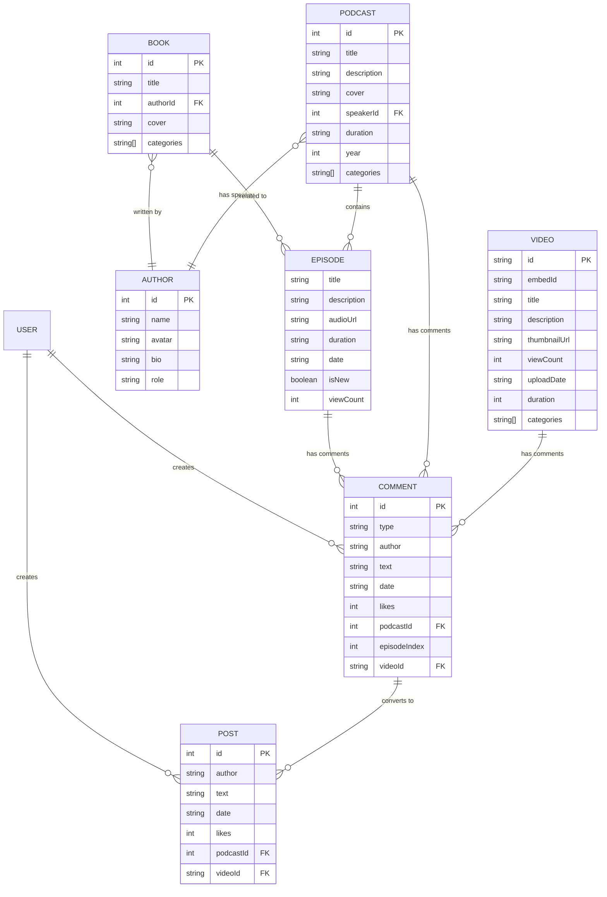
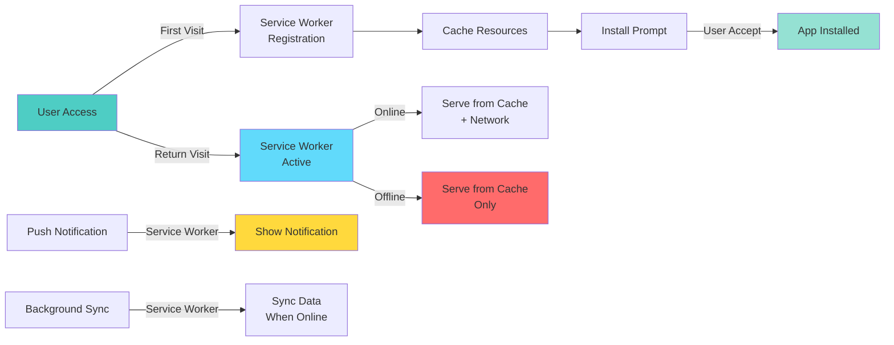
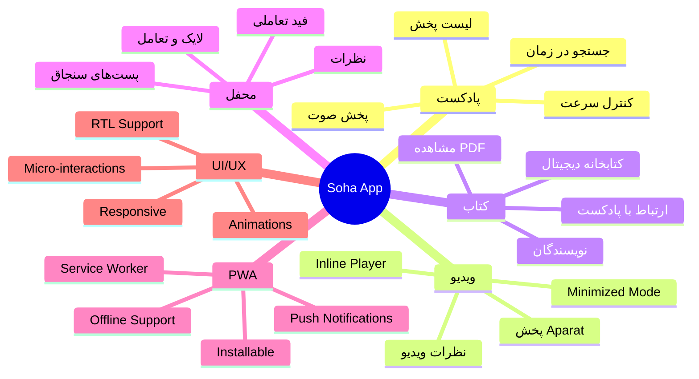

<div align="center">
  <h1>🎙️ Soha Podcast App</h1>
  <p>یک پلتفرم جامع پادکست، ویدیو و کتاب برای محتوای فکری و اندیشمندانه</p>
  
  <p>
    
    
    
    
  </p>
  
  <p>
    
    
    
  </p>
</div>

---

## 📖 معرفی پروژه

**Soha Podcast App** یک اپلیکیشن وب پیشرفته و مدرن است که برای ارائه محتوای صوتی، ویدیویی و متنی طراحی شده است. این پروژه با استفاده از **React 19** و **TypeScript** ساخته شده و قابلیت‌های متنوعی برای مدیریت و پخش محتوا ارائه می‌دهد. این پلتفرم با تمرکز بر **تجربه کاربری حرفه‌ای** و **طراحی تعاملی**، یک راه‌حل جامع برای دسترسی به محتوای فکری و اندیشمندانه است.

### ✨ ویژگی‌های کلیدی

- 🎧 **پخش پادکست**: پخش کننده صوت پیشرفته با قابلیت کنترل سرعت، جستجو در زمان و مدیریت لیست پخش
- 🎬 **پخش ویدیو**: پشتیبانی کامل از ویدیوهای Aparat با پخش کننده inline و minimized
- 📚 **کتابخانه دیجیتال**: دسترسی به کتاب‌ها و نویسندگان با امکان مشاهده PDF
- 👥 **محفل (Community)**: سیستم تعاملی برای نظرات، پست‌ها و بحث‌ها
- 🔐 **احراز هویت کاربر**: سیستم ورود و ثبت‌نام با ذخیره علاقه‌مندی‌ها
- ⚙️ **پنل مدیریت**: صفحه مدیریت برای افزودن و ویرایش پادکست‌ها و ویدیوها
- 📱 **PWA**: پشتیبانی کامل Progressive Web App با Service Worker
- 🌙 **رابط کاربری فارسی**: طراحی RTL با رابط کاربری زیبا و واکنش‌گرا

---

## 🛠️ تکنولوژی‌های استفاده شده

### 🎯 Stack تکنولوژی

#### Frontend Stack
- **React 19** ⚛️ - کتابخانه UI مدرن با Hooks و Concurrent Rendering
- **TypeScript** 🔷 - تایپ‌ایمنی کامل برای توسعه امن‌تر
- **Vite** ⚡ - ابزار build فوق‌العاده سریع با HMR
- **CSS3** 🎨 - استایل‌دهی پیشرفته با Animations و Transitions

#### Backend Stack
- **Node.js** 🟢 - محیط اجرای JavaScript سمت سرور
- **Express** 🚀 - فریمورک وب سریع و minimalist
- **PostgreSQL** 🐘 - پایگاه داده رابطه‌ای قدرتمند
- **CORS** 🌐 - مدیریت امن درخواست‌های cross-origin

### 📊 معماری سیستم



---

## 📁 ساختار پروژه

```
emamobilepro/
├── components/          # کامپوننت‌های React
│   ├── AppHeader.tsx
│   ├── BottomTabs.tsx
│   ├── FullScreenPlayer.tsx
│   ├── MinimizedPlayer.tsx
│   ├── InlineVideoPlayer.tsx
│   ├── PdfViewer.tsx
│   └── ...
├── pages/              # صفحات اصلی اپلیکیشن
│   ├── HomePage.tsx
│   ├── SowtPage.tsx    # صفحه پادکست‌ها
│   ├── VideoListPage.tsx
│   ├── MatnPage.tsx    # صفحه کتاب‌ها
│   ├── CommentsCommunityPage.tsx  # صفحه محفل
│   ├── AdminPage.tsx
│   └── ...
├── services/           # سرویس‌های API
│   └── api.ts
├── data/               # داده‌های محلی
│   ├── database.ts
│   └── database.json
├── utils/              # توابع کمکی
│   ├── helpers.ts
│   └── aparatApi.ts
├── types.ts            # تعریف تایپ‌های TypeScript
├── App.tsx             # کامپوننت اصلی
├── index.tsx           # نقطه ورود
├── vite.config.ts      # تنظیمات Vite
├── service-worker.js   # Service Worker برای PWA
└── soha-backend/       # Backend API
    ├── index.js
    ├── seed.js
    └── package.json
```

---

## 🚀 راه‌اندازی پروژه

### پیش‌نیازها

- **Node.js** نسخه 18 یا بالاتر
- **npm** یا **yarn** یا **pnpm**
- (اختیاری) **PostgreSQL** برای Backend

### نصب و اجرا

1. **کلون کردن پروژه**
   ```bash
   git clone https://github.com/emadch82/emapro.git
   cd emamobilepro
   ```

2. **نصب dependencies**
   ```bash
   npm install
   ```

3. **اجرای پروژه در حالت توسعه**
   ```bash
   npm run dev
   ```
   
   پروژه در آدرس `http://localhost:3000` اجرا می‌شود.

4. **ساخت نسخه production**
   ```bash
   npm run build
   ```

5. **پیش‌نمایش نسخه production**
   ```bash
   npm run preview
   ```

### راه‌اندازی Backend (اختیاری)

اگر می‌خواهید از Backend استفاده کنید:

```bash
cd soha-backend
npm install
```

سپس یک فایل `.env` ایجاد کنید:

```env
DB_HOST=localhost
DB_PORT=5432
DB_NAME=soha_db
DB_USER=your_username
DB_PASSWORD=your_password
PORT=5000
```

و اجرا کنید:

```bash
npm start
# یا برای seed کردن دیتابیس
npm run seed
```

---

## 📱 صفحات و قابلیت‌ها

### 🎯 جریان کار کاربر



### 🎧 صفحه صوت (Sowt)
**یک تجربه کامل برای شنیدن محتوای صوتی**

- 📋 **لیست پادکست‌ها**: نمایش همه پادکست‌ها با دسته‌بندی و فیلتر
- 🔍 **جستجوی پیشرفته**: جستجو در عنوان، توضیحات و نام نویسندگان
- 👨‍🏫 **پروفایل نویسندگان**: نمایش کامل پروفایل استادان و نویسندگان
- ▶️ **پخش اپیزودها**: پخش اپیزودهای پادکست با کنترل کامل
- 🔄 **لیست پخش خودکار**: پخش خودکار اپیزود بعدی

### 🎬 صفحه ویدیو (Videos)
**تماشای ویدیو با تجربه‌ای روان و تعاملی**

- 📺 **نمایش ویدیوهای Aparat**: پشتیبانی کامل از ویدیوهای پلتفرم Aparat
- 🎮 **پخش کننده هوشمند**: پخش inline و minimized برای دسترسی آسان
- 💬 **سیستم نظرات**: ثبت و مشاهده نظرات برای هر ویدیو
- 🔎 **جستجو و فیلتر**: فیلتر بر اساس دسته‌بندی و تاریخ
- 📊 **آمار بازدید**: نمایش تعداد بازدید و مدت زمان ویدیو

### 📚 صفحه متن (Matn)
**کتابخانه دیجیتال کامل با دسترسی آسان**

- 📖 **کتابخانه دیجیتال**: دسترسی به تمام کتاب‌های موجود
- 👤 **پروفایل نویسندگان**: نمایش کتاب‌های هر نویسنده
- 📄 **مشاهده PDF**: مشاهده فایل PDF کتاب‌ها در مرورگر
- 🔗 **ارتباط با پادکست‌ها**: لینک بین کتاب‌ها و اپیزودهای مرتبط
- 🏷️ **دسته‌بندی**: فیلتر کتاب‌ها بر اساس موضوع

### 👥 محفل (Mahfel)
**جایی برای تبادل نظر و تعامل اجتماعی**

- 📰 **فید تعاملی**: نمایش پست‌های مرتبط با پادکست و ویدیو
- 💬 **نظرات و پاسخ‌ها**: سیستم کامنت با قابلیت پاسخ
- ❤️ **لایک و تعامل**: لایک کردن پست‌ها و نظرات
- 📌 **پست‌های سنجاق شده**: نمایش مهم‌ترین پست‌ها در بالای فید
- 🔔 **اعلان‌ها**: اطلاع‌رسانی برای نظرات و تعاملات جدید

### ⚙️ پنل مدیریت
**ابزار قدرتمند برای مدیریت محتوا**

- ➕ **افزودن محتوا**: افزودن پادکست و ویدیو جدید به سادگی
- ✏️ **ویرایش اطلاعات**: ویرایش اطلاعات موجود با رابط کاربری آسان
- 🗑️ **حذف محتوا**: مدیریت و حذف محتوای غیرضروری
- 📊 **مدیریت داده‌ها**: دسترسی کامل به تمام داده‌های سیستم

### 👤 پروفایل کاربر
**فضای شخصی برای مدیریت حساب کاربری**

- ⭐ **مدیریت علاقه‌مندی‌ها**: انتخاب و مدیریت علاقه‌مندی‌های شخصی
- 📚 **کتابخانه شخصی**: دسترسی سریع به محتوای ذخیره شده
- 📜 **تاریخچه پخش**: مشاهده تاریخچه پادکست و ویدیوهای مشاهده شده
- ⚙️ **تنظیمات**: تنظیمات شخصی‌سازی حساب کاربری

---

## 🎮 نحوه استفاده

### 📖 راهنمای گام به گام

#### 🎧 پخش پادکست



**مراحل:**
1. 🎵 به صفحه **صوت (Sowt)** بروید از طریق منوی پایین صفحه
2. 📋 لیست پادکست‌ها را مشاهده کنید و پادکست مورد نظر را انتخاب کنید
3. ▶️ اپیزود مورد نظر را انتخاب و پخش کنید
4. 🎮 از کنترل‌های پخش کننده استفاده کنید:
   - ⏪ **قبلی/بعدی**: تغییر به اپیزود قبلی یا بعدی
   - ⏯️ **توقف/پخش**: توقف یا ادامه پخش
   - ⏩ **جستجو**: جابه‌جایی در زمان پخش
   - ⚡ **سرعت**: تغییر سرعت پخش (0.5x تا 2x)
   - 💬 **نظر**: ثبت نظر در زمان مشخص

#### 🎬 پخش ویدیو



**مراحل:**
1. 📺 به صفحه **ویدیو (Videos)** بروید
2. 🎬 ویدیو مورد نظر را انتخاب کنید
3. ▶️ ویدیو به صورت **inline** پخش می‌شود
4. ⬇️ می‌توانید ویدیو را **minimized** کنید و به صفحات دیگر بروید
5. 💬 نظرات خود را برای ویدیو ثبت کنید

#### 💬 افزودن نظر

**برای پادکست:**
1. 🎧 در حین پخش پادکست، دکمه نظر را بزنید
2. 📝 نظر خود را در زمان مشخص (timestamp) ثبت کنید
3. ✅ نظر شما به صورت خودکار در محفل نمایش داده می‌شود

**برای ویدیو:**
1. 🎬 در صفحه ویدیو، بخش نظرات را باز کنید
2. 📝 نظر خود را بنویسید و ثبت کنید
3. 📰 نظر شما در محفل نیز نمایش داده می‌شود

#### ⚙️ مدیریت محتوا

1. 🔑 از هدر، به **پنل مدیریت** دسترسی پیدا کنید
2. ➕ پادکست یا ویدیو جدید اضافه کنید
3. ✏️ اطلاعات موجود را ویرایش کنید
4. 🗑️ در صورت نیاز، محتوا را حذف کنید

---

## 🔧 تنظیمات پیشرفته

### متغیرهای محیطی

می‌توانید یک فایل `.env.local` ایجاد کنید:

```env
GEMINI_API_KEY=your_gemini_api_key_here
```

### تنظیمات Vite

فایل `vite.config.ts` را برای تنظیمات خاص خود ویرایش کنید:

```typescript
export default defineConfig({
  server: {
    port: 3000,
    host: '0.0.0.0',
  },
  // ...
});
```

---

## 📦 ساختار داده

### 🔗 رابطه بین داده‌ها



### 📝 تعریف انواع داده‌ها

#### 🎧 Podcast (پادکست)
```typescript
interface Podcast {
  id: number;                    // شناسه یکتا
  title: string;                 // عنوان پادکست
  description: string;           // توضیحات
  cover: string;                 // تصویر جلد
  speakerId: number;             // شناسه نویسنده/استاد
  duration: string;              // مدت زمان کل
  episodes: Episode[];           // لیست اپیزودها
  year: number;                  // سال انتشار
  categories: string[];          // دسته‌بندی‌ها
}
```

#### 🎬 Video (ویدیو)
```typescript
interface Video {
  id: string;                    // شناسه یکتا
  embedId: string;               // شناسه embed در Aparat
  title: string;                 // عنوان ویدیو
  description: string;           // توضیحات
  thumbnailUrl: string;          // تصویر thumbnail
  viewCount: number;             // تعداد بازدید
  uploadDate: string;            // تاریخ آپلود
  duration: number;              // مدت زمان (ثانیه)
  categories: string[];          // دسته‌بندی‌ها
}
```

#### 📚 Book (کتاب)
```typescript
interface Book {
  id: number;                    // شناسه یکتا
  title: string;                 // عنوان کتاب
  authorId: number;              // شناسه نویسنده
  cover: string;                 // تصویر جلد
  relatedEpisodes: Array<{       // اپیزودهای مرتبط
    podcastId: number;
    episodeIndex: number;
  }>;
  categories: string[];          // دسته‌بندی‌ها
  description?: string;          // توضیحات (اختیاری)
}
```

---

## 🎨 طراحی و تجربه کاربری (UI/UX)

این پروژه با تمرکز بر **تجربه کاربری حرفه‌ای** و **طراحی تعاملی** ساخته شده است. تمام جزئیات UI/UX با دقت و با استانداردهای روز صنعت طراحی شده‌اند.

### ✨ ویژگی‌های طراحی تعاملی

#### 🎭 انیمیشن‌ها و ترنزیشن‌ها
- **انیمیشن‌های نرم و روان** با استفاده از CSS transitions و transforms
- **Micro-interactions** در کلیک‌ها و تعاملات کاربر
- **Loading states** برای بهبود درک کاربر از وضعیت سیستم
- **Smooth scrolling** با scroll behavior برای تجربه بهتر

#### 📱 طراحی واکنش‌گرا (Responsive Design)
- **Mobile-First Approach**: طراحی اول برای موبایل سپس برای دسکتاپ
- **Breakpoints دقیق** برای همه اندازه‌های صفحه نمایش
- **Adaptive Layout**: تغییر خودکار چیدمان بر اساس فضای موجود
- **Touch-friendly**: دکمه‌ها و عناصر با اندازه مناسب برای لمس

#### 🎯 تعاملات کاربری پیشرفته
- **Sticky Header**: هدر هوشمند که هنگام اسکرول مخفی می‌شود
- **Minimized Player**: پخش کننده که در پایین صفحه شناور می‌ماند
- **Inline Video Player**: پخش ویدیو بدون نیاز به باز کردن صفحه جدید
- **Toast Notifications**: اعلان‌های ظریف و غیر مزاحم
- **Pull-to-Refresh**: امکان رفرش محتوا با کشیدن صفحه

#### 🌐 پشتیبانی RTL کامل
- **Layout RTL**: چیدمان کامل راست‌به‌چپ برای فارسی
- **Typography RTL**: فونت‌ها و فاصله‌گذاری‌های بهینه شده برای فارسی
- **Direction-aware Components**: همه کامپوننت‌ها از RTL پشتیبانی می‌کنند
- **Icon Alignment**: آیکون‌ها و المان‌های بصری برای RTL تنظیم شده‌اند

#### 🎨 اصول طراحی بصری
- **Visual Hierarchy**: سلسله مراتب بصری واضح برای راهنمایی کاربر
- **Color System**: استفاده از رنگ‌های هماهنگ و معنادار
- **Typography Scale**: سایزهای فونت استاندارد و خوانا
- **Spacing System**: سیستم فاصله‌گذاری منسجم و هماهنگ
- **Shadow & Depth**: استفاده از سایه برای ایجاد عمق و لایه‌بندی

#### 💡 بهبودهای تجربه کاربری
- **Progressive Disclosure**: نمایش تدریجی اطلاعات برای کاهش بار شناختی
- **Feedback Loops**: بازخورد فوری به هر عمل کاربر
- **Error Handling**: نمایش خطاها به صورت کاربرپسند و راهنما
- **Empty States**: طراحی صفحات خالی برای بهبود درک کاربر
- **Loading States**: نمایش وضعیت بارگذاری با انیمیشن و placeholder

#### 🎪 کامپوننت‌های تعاملی
- **Player Controls**: کنترل‌های پخش با hover effects و animations
- **Card Interactions**: کارت‌ها با hover و active states
- **Modal Animations**: باز و بسته شدن مدال‌ها با انیمیشن
- **Form Elements**: فرم‌ها با validation feedback و focus states
- **Navigation**: منوی ناوبری با smooth transitions

---

## 📝 ویژگی‌های PWA (Progressive Web App)

این پروژه یک **Progressive Web App** کامل و حرفه‌ای است که تجربه اپلیکیشن بومی را ارائه می‌دهد.

### 🎯 نمودار عملکرد PWA



### ✨ قابلیت‌های PWA

#### 🔧 Service Worker
- **Cache Strategy**: استراتژی هوشمند caching برای محتوای استاتیک و دینامیک
- **Offline Support**: کار کامل در حالت آفلاین با استفاده از cache
- **Background Sync**: همگام‌سازی خودکار داده‌ها هنگام اتصال اینترنت
- **Update Management**: مدیریت به‌روزرسانی‌ها بدون نیاز به رفرش دستی

#### 🔔 Notification API
- **Push Notifications**: اعلان‌های push برای نظرات جدید و تعاملات
- **Service Worker Support**: پشتیبانی کامل از Service Worker برای اعلان‌ها
- **Custom Icons**: آیکون‌های سفارشی برای اعلان‌ها
- **Badge Support**: نمایش badge برای تعداد اعلان‌های خوانده نشده

#### 📱 Installable
- **Mobile Installation**: نصب روی موبایل با یک کلیک
- **Desktop Installation**: نصب روی دسکتاپ (Windows, Mac, Linux)
- **App Icon**: آیکون اختصاصی برای صفحه اصلی
- **Splash Screen**: صفحه splash هنگام باز شدن اپلیکیشن

#### ⚡ Performance
- **Fast Loading**: بارگذاری سریع با استفاده از cache
- **Lazy Loading**: بارگذاری تدریجی برای بهینه‌سازی استفاده از منابع
- **Code Splitting**: تقسیم کد برای کاهش حجم اولیه
- **Image Optimization**: بهینه‌سازی تصاویر برای بارگذاری سریع‌تر

---

## 📊 آمار و ویژگی‌های پروژه

### 🎯 نمودار کلی ویژگی‌ها



### 📈 مشخصات فنی پروژه

| ویژگی | مقدار |
|-------|-------|
| **Framework** | React 19 |
| **Language** | TypeScript 5.8 |
| **Build Tool** | Vite 6.2 |
| **Styling** | CSS3 + Animations |
| **Backend** | Node.js + Express |
| **Database** | PostgreSQL |
| **PWA** | ✅ کامل |
| **RTL** | ✅ پشتیبانی کامل |
| **Responsive** | ✅ Mobile-First |

### 🎨 آمار کامپوننت‌ها

- **صفحات اصلی**: 19 صفحه
- **کامپوننت‌های UI**: 15+ کامپوننت
- **سرویس‌های API**: 1 سرویس اصلی
- **Type Definitions**: 10+ interface
- **PWA Features**: 6+ ویژگی اصلی

---

## 👨‍💻 توسعه‌دهنده

### 💼 اطلاعات تماس

- **نام**: Emad Ch
- **GitHub**: [@emadch82](https://github.com/emadch82)
- **Repository**: [Soha Podcast App](https://github.com/emadch82/emapro)

---

<div align="center">
  
  ### 🌟 ساخته شده با ❤️ برای جامعه ایرانی
  
  **یک پلتفرم کامل برای دسترسی به محتوای فکری و اندیشمندانه**
  
  [](https://github.com/emadch82/emapro)
  [](https://react.dev/)
  [](https://www.typescriptlang.org/)
  [](https://vitejs.dev/)
  
</div>
